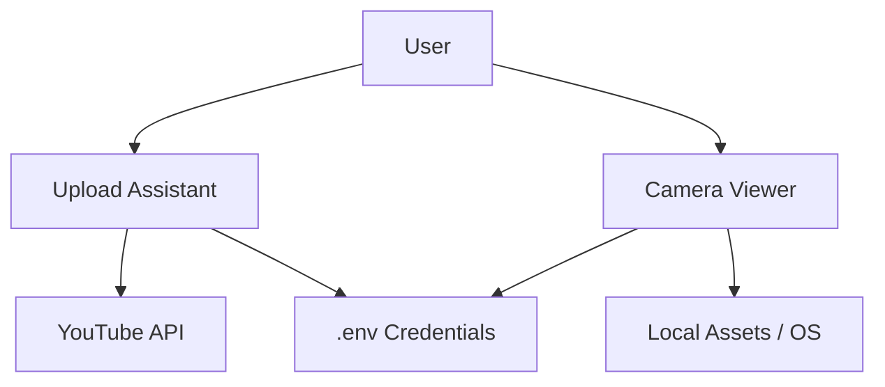

# 📺 YouTube Companion
**The Ultimate Swiss-Army Knife for @thevibecoder69**

[](https://github.com/google/gemini-cli)
[](https://www.python.org/)
[](https://streamlit.io/)
[](https://opensource.org/licenses/MIT)

**YouTube Companion** is a dedicated tool suite designed to automate and streamline the content creation workflow for Ayush's YouTube channel. It features an **Upload Assistant** and a **File Viewer/Camera Viewer** to manage assets with ease.

`✅ YouTube API Integration | ✅ Real-time Camera Roll | ✅ MIT Licensed | ✅ Environment-Aware`

## 📦 Features
- **Upload Assistant**: Surgical file uploads and metadata management.

## 🏗 Architecture
The suite is organized into independent Streamlit micro-apps, sharing a common environment and asset pool.



### Core Components
- **Upload Assistant (`upload-assistant/`)**: Handles OAuth flow, metadata injection, and reliable uploads via the official YouTube Data API.
- **Camera Viewer (`camera-viewer/`)**: Provides real-time asset browsing, camera roll management, and metadata extraction via `yt-dlp`.
- **Environment Logic**: Centralized `.env` and `.streamlit/config.toml` for seamless local development and secure key management.
- **Camera/File Viewer**: Real-time asset previewing for Streamlit-based workflows.
- **Environment Aware**: Configurable via `.env` for secure credential management.

## 🛠 Setup

1. **Clone and Install**:
   ```bash
   git clone https://github.com/ayushxx7/youtube-companion.git
   cd youtube-companion
   pip install -r requirements.txt
   ```

2. **Configure Environment**:
   Copy `.env.example` to `.env` and add your YouTube API keys/credentials.

3. **Run the Tools**:
   - **Upload Assistant**: `streamlit run upload-assistant/app.py`
   - **Camera Viewer**: `streamlit run camera-viewer/app.py`

## 📜 License
This project is licensed under the **MIT License** - see the [LICENSE](LICENSE) file for details.

---
*Built with ❤️ for @thevibecoder69.*
