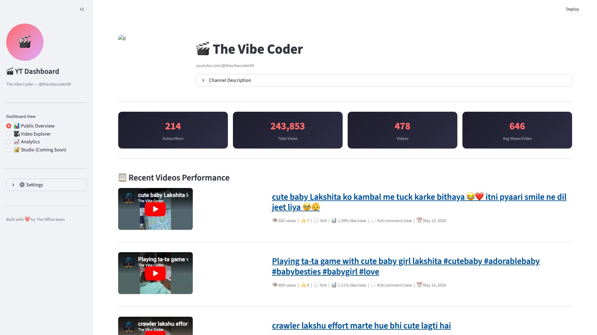
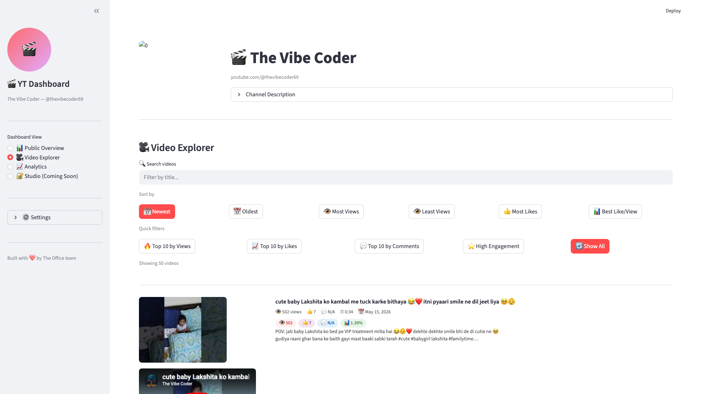
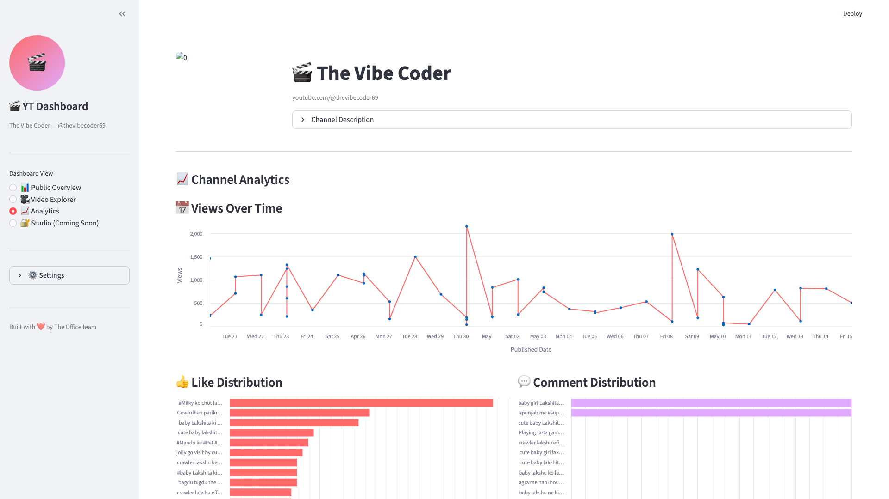

# 📺 YouTube Companion
**The Ultimate Swiss-Army Knife for @thevibecoder69**

[](https://github.com/google/gemini-cli)
[](https://www.python.org/)

**YouTube Companion** is a dedicated tool suite designed to automate and streamline the content creation workflow for Ayush's YouTube channel.

`✅ YouTube API Integration | ✅ Real-time Camera Roll | ✅ Analytics Dashboard | ✅ MIT Licensed`

## 🎬 UI Previews

| 📊 Analytics Dashboard | 📤 Upload Assistant | 📷 Camera Viewer | 📺 YT Dashboard |
| :---: | :---: | :---: | :---: |
|  |  |  |  |

## 🏗 Architecture
The suite is organized into independent micro-apps, sharing a common environment and asset pool.

### Core Components
- **Upload Assistant**: Handles OAuth flow, surgical metadata injection, and reliable uploads via official APIs. AI-powered metadata generation via OpenRouter.
- **Camera Viewer**: Provides real-time asset browsing, camera roll management, and metadata extraction via `yt-dlp`. Flask-based web UI.
- **Analytics Intelligence**: YouTube analytics dashboard with custom KPIs (Hook Score, Packaging Score, Engagement Efficiency). Includes FastMCP server for AI-driven analysis.
- **YT Dashboard**: Streamlit-based YouTube channel analytics dashboard with 4 views — Public Overview (channel stats, video embeds, top videos), Video Explorer (filterable/sortable video cards with embedded players), Analytics (views over time, engagement charts), and Studio placeholder for OAuth-only metrics. Built with `uv` for dependency management.
- **Environment Hub**: Centralized `.env` and `.streamlit/config.toml` for seamless key management.

## 🚀 Key Features
- 📤 **Automated Uploads**: Manage YouTube uploads with precision metadata control and AI-generated titles/descriptions.
- 📷 **Asset Management**: Preview and manage local camera assets in real-time via ADB.
- 📊 **Analytics Dashboard**: Track Hook Score, Packaging Score, and Engagement Efficiency with Plotly visualizations.
- 🤖 **MCP Server**: FastMCP-powered tools for video performance analysis and comparison.
- 🛠 **Extendable**: Micro-app architecture ready for new automation tools.

## 🛠 Setup

```bash
git clone https://github.com/ayushxx7/youtube-companion.git
```

Each tool is self-contained:

```bash
# Analytics Intelligence
cd analytics-intelligence
python setup.py           # install deps + seed demo data
streamlit run dashboard/app.py

# Upload Assistant
cd upload-assistant
uv run streamlit run app.py

# YT Dashboard
cd yt-dashboard
uv sync
cp .env.example .env      # add your YouTube API key
uv run streamlit run app.py

# Camera Viewer
cd camera-viewer
python app.py
```

## 📺 YT Dashboard

A full-featured YouTube channel analytics dashboard built with Streamlit. Tracks views, likes, comments, engagement ratios, and more for @thevibecoder69.

### Views

**📊 Public Overview** — Channel header with subscriber count, total views, video count. Recent videos table with embedded YouTube players, metrics, and engagement ratios.


**🎥 Video Explorer** — Filterable/sortable video cards with embedded players. Sort by date, views, likes, or engagement. Quick filter chips for top performers.



**📈 Analytics** — Views over time, like/comment distribution, engagement scatter plot, summary statistics, and raw data table.



**🔐 Studio (Coming Soon)** — Placeholder for YouTube Analytics API OAuth metrics: impressions, CTR, audience retention, traffic sources.

### Setup
```bash
cd yt-dashboard
uv sync
cp .env.example .env      # add your YouTube API key
uv run streamlit run app.py
```

## 📜 License
This project is licensed under the **MIT License** - see the [LICENSE](LICENSE) file for details.

---
*Built with ❤️ for @thevibecoder69.*
