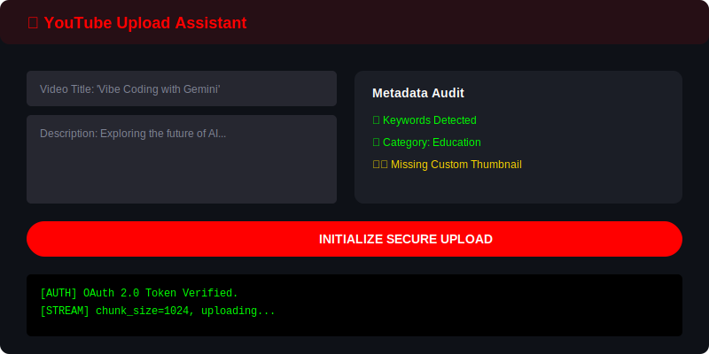
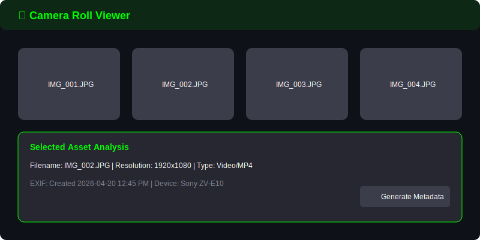
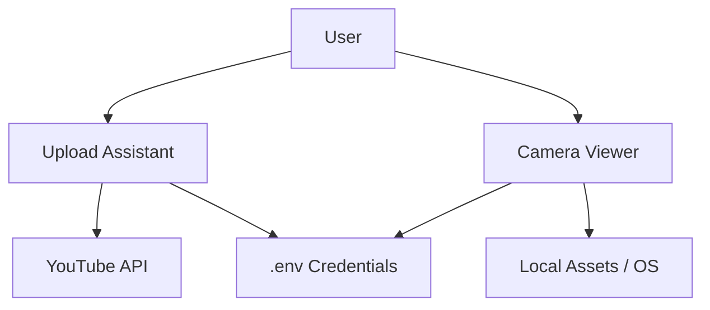

# 📺 YouTube Companion
**The Ultimate Swiss-Army Knife for @thevibecoder69**

[](https://github.com/google/gemini-cli)
[](https://www.python.org/)

**YouTube Companion** is a dedicated tool suite designed to automate and streamline the content creation workflow for Ayush's YouTube channel.

`✅ YouTube API Integration | ✅ Real-time Camera Roll | ✅ MIT Licensed | ✅ Environment-Aware`

## 🎬 UI Previews
| 📤 Upload Assistant | 📷 Camera Viewer |
| :---: | :---: |
|  |  |

## 🏗 Architecture
The suite is organized into independent Streamlit micro-apps, sharing a common environment and asset pool.



### Core Components
- **Upload Assistant**: Handles OAuth flow, surgical metadata injection, and reliable uploads via official APIs.
- **Camera Viewer**: Provides real-time asset browsing, camera roll management, and metadata extraction via `yt-dlp`.
- **Environment Hub**: Centralized `.env` and `.streamlit/config.toml` for seamless key management.

## 🚀 Key Features
- 📤 **Automated Uploads**: Manage YouTube uploads with precision metadata control.
- 📷 **Asset Management**: Preview and manage local camera assets in real-time.
- 🛠 **Extendable**: Micro-app architecture ready for new automation tools.

## 🛠 Setup
```bash
git clone https://github.com/ayushxx7/youtube-companion.git
pip install -r requirements.txt
# Configure .env with your YouTube API keys
streamlit run upload-assistant/app.py
```

## 📜 License
This project is licensed under the **MIT License** - see the [LICENSE](LICENSE) file for details.

---
*Built with ❤️ for @thevibecoder69.*
